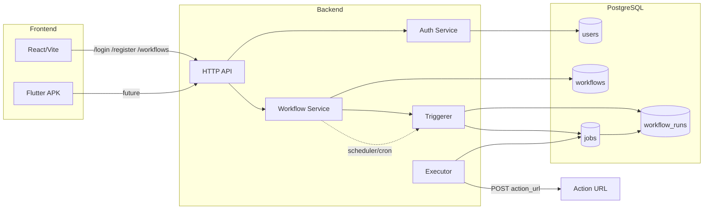
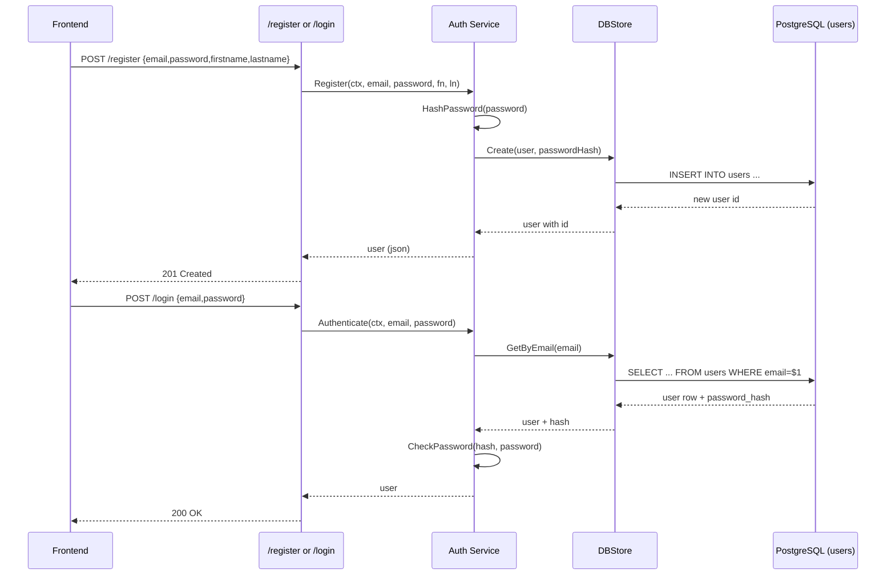
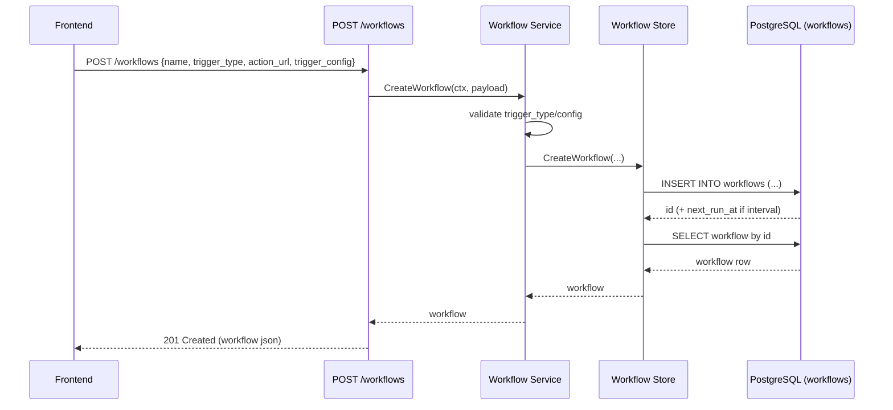
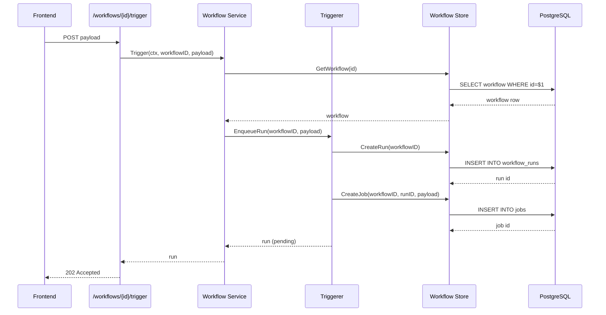
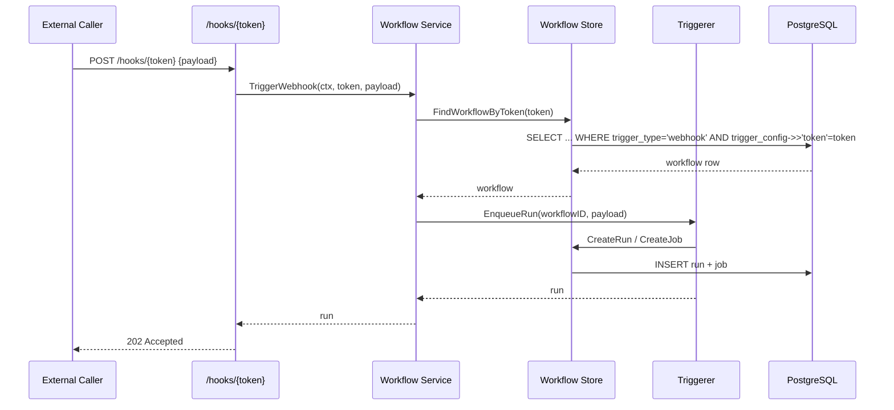
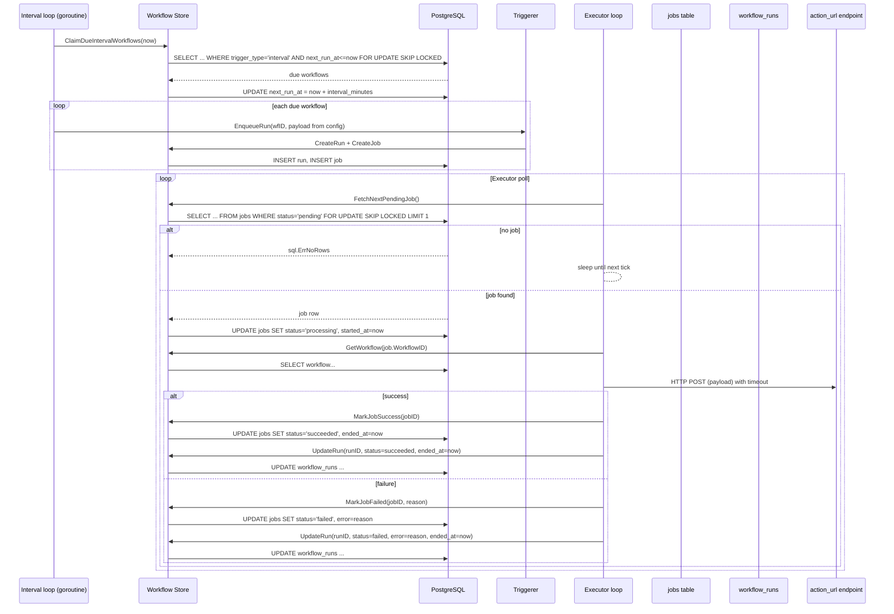

## KiKonect Backend Interaction Diagrams

### System Overview

### Auth: Register & Login

### Workflow Creation

### Manual Trigger (POST /workflows/{id}/trigger)

### Webhook Trigger (POST /hooks/{token})

### Interval Scheduler + Executor Loop

